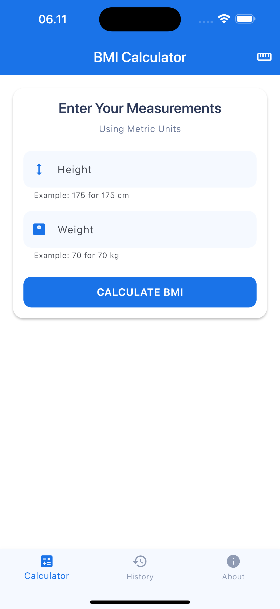
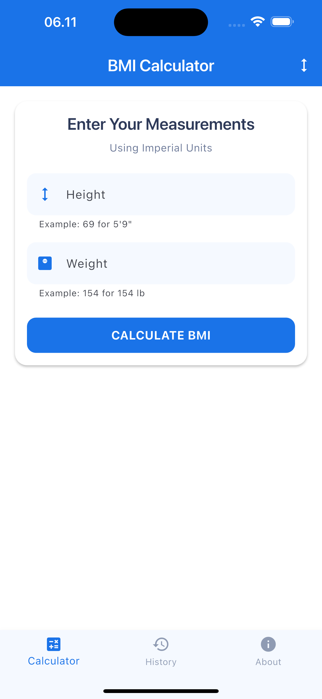
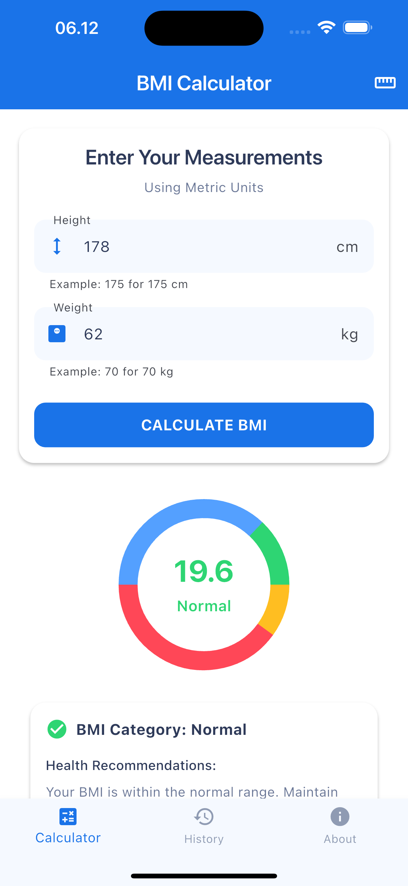
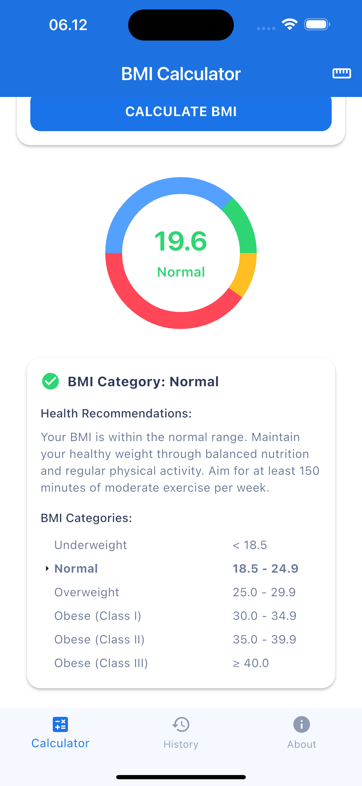
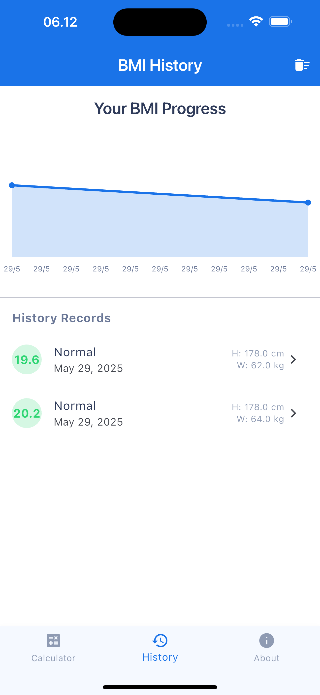
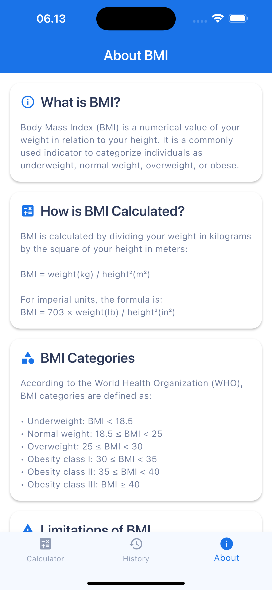

# BMI Calculator App

A modern, feature-rich BMI (Body Mass Index) calculator application built with Flutter. This app helps users track their BMI over time with a beautiful UI, interactive charts, and personalized health recommendations.

## 📱 Screenshots

<div style="display: flex; flex-wrap: wrap; gap: 10px; justify-content: center;">
  
  
  
  
  
  
  
  
</div>

## ✨ Features

- **BMI Calculation**: Calculate BMI using height and weight inputs
- **Health Categories**: Automatically categorize BMI results (Underweight, Normal, Overweight, Obese)
- **Personalized Recommendations**: Get health advice based on your BMI category
- **History Tracking**: Save and view your BMI history over time
- **Interactive Charts**: Visualize your BMI progress with beautiful charts
- **Detailed Records**: View detailed information for each BMI record
- **Swipe to Delete**: Easily remove individual records with swipe gestures
- **Clean UI/UX**: Modern, intuitive interface with smooth animations
- **Responsive Design**: Works on various screen sizes and orientations
- **Local Storage**: All data is stored locally on your device for privacy

## 🛠️ Technologies Used

- **Flutter**: Cross-platform UI framework
- **Provider**: State management
- **Shared Preferences**: Local data persistence
- **FL Chart**: Interactive charts for data visualization
- **Flutter ScreenUtil**: Responsive UI design
- **Lottie**: Beautiful animations
- **Intl**: Internationalization and formatting

## 🚀 Getting Started

### Prerequisites

- Flutter SDK (version 3.7.2 or higher)
- Dart SDK (version 3.0.0 or higher)
- Android Studio / VS Code
- Android SDK / Xcode (for iOS development)

### Installation

1. Clone the repository:
   ```bash
   git clone https://github.com/yourusername/bmi.git
   ```

2. Navigate to the project directory:
   ```bash
   cd bmi
   ```

3. Install dependencies:
   ```bash
   flutter pub get
   ```

4. Run the app:
   ```bash
   flutter run
   ```

## 📋 Project Structure

```
lib/
├── main.dart                  # App entry point
├── models/                    # Data models
│   └── bmi_model.dart         # BMI calculation model
├── providers/                 # State management
│   └── bmi_provider.dart      # BMI data provider
├── screens/                   # App screens
│   ├── home_screen.dart       # Main calculator screen
│   ├── history_screen.dart    # BMI history screen
│   └── ...                    # Other screens
├── utils/                     # Utility functions
│   └── app_theme.dart         # Theme configuration
└── widgets/                   # Reusable UI components
    ├── bmi_history_chart.dart # BMI chart widget
    └── ...                    # Other widgets
```

## 👨‍💻 Developer

**Dody Rachmat Wicaksono**  
Website: [www.nicecoder.com](https://www.nicecoder.com)  
Email: [dody@nicecoder.com](mailto:dody@nicecoder.com)

Contact me for custom mobile app development!

## 📄 License

This project is licensed under the MIT License - see the LICENSE file for details.
